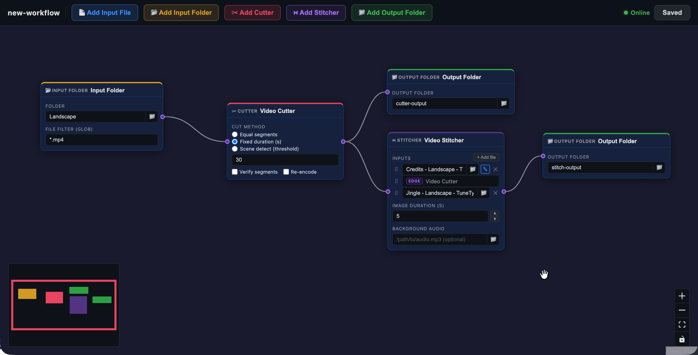

# video-pipeline

[](https://github.com/shaztechio/video-pipeline/actions/workflows/ci.yml)
[](https://www.npmjs.com/package/@shaztech/video-pipeline)



A visual node-based pipeline tool for composing video processing workflows using [`video-cutter`](https://github.com/shaztechio/video-cutter) and [`video-stitcher`](https://github.com/shaztechio/video-stitcher).

## Overview

Create pipelines by connecting nodes on a visual canvas. Each node is an instance of a CLI tool. The pipeline is stored as a JSON spec file on disk and can be executed directly from the command line.

**Node types:**

- **Input File** — provides a single file path. Connect to a Cutter node as its input source.
- **Input Folder** — scans a folder and provides all matching file paths (with optional glob filter). Connect to a Cutter node to batch-process every file in the folder.
- **Video Cutter** — cuts a video into N segments (equal count, fixed duration, or scene detection). Input comes from a connected Input File or Input Folder node. Segments are written to a `cutter-output/` folder next to the input file by default, or to a connected Output Folder node.
- **Video Stitcher** — for each cutter segment, stitches fixed inputs + that segment into one output file. Outputs go to a `stitch-output/` folder next to the cutter's input file by default, or to a connected Output Folder node. When an Input Folder feeds multiple files through the cutter, stitcher outputs are organised into per-source subfolders (e.g. `stitch-output/movie1/seg_01.mp4`).
- **Output Folder** — specifies an explicit output directory. Connect one or more Output Folder nodes to a Cutter or Stitcher to override the default output location. When multiple Output Folder nodes are connected, outputs are written to the first and copied to the rest.

**Data flow:** Each segment produced by a cutter node generates a separate output from the connected stitcher. For example, a cutter producing 3 segments with a stitcher configured as `[intro, EDGE(cutter), credits]` produces 3 output files — one per segment — each wrapped with the fixed inputs.

**Batch mode:** When an Input Folder node is connected to a Cutter, every file in the folder is cut independently. All resulting segments flow into the downstream Stitcher, which organises outputs into per-source subfolders automatically.

## Installation

```bash
npm install -g @shaztech/video-pipeline
```

Requires Node.js 20+ and FFmpeg installed on your system.

## Usage

### Create a new pipeline spec

```bash
video-pipeline create my-workflow
# Creates my-workflow.json in the current directory
```

### Open the visual editor

```bash
video-pipeline edit my-workflow.json
# Starts a local server and opens the editor in your browser
```

The editor lets you:
- Drag **Input File**, **Input Folder**, **Cutter**, **Stitcher**, and **Output Folder** nodes onto the canvas — new nodes appear centred in the current viewport
- Connect Input File or Input Folder to a Cutter's left handle to supply its input
- Connect a Cutter or Stitcher output handle to one or more Output Folder nodes
- Configure each node's parameters directly on the node
- Click the pipeline name in the toolbar to rename it (saved with the spec)
- Use the native OS file/folder picker (📁) on any file field
- Set a glob filter on Input Folder nodes (e.g. `*.mp4`; blank = all files)
- Drag inputs to reorder them within a Stitcher node
- Set per-image duration overrides (✎ pencil icon on image inputs)
- Burn a sequence number label (e.g. `scene 3/10`) into fixed image inputs via the **#** button on an image row, or into the whole output video via the **#** button in the *Output video sequence label* section — configure prefix, font, size, colour, background box, padding, position (9 presets + custom X/Y), and a total offset to adjust the denominator. Per-image and whole-video labels can be combined.
- Delete nodes with the **×** button that appears on hover
- Save with **⌘S** (macOS) / **Ctrl+S** (Windows/Linux) or the Save button

### Execute a pipeline

```bash
video-pipeline run my-workflow.json

# Keep intermediate temp files
video-pipeline run my-workflow.json --keep-temp

# Dry run — print execution plan without running
video-pipeline run my-workflow.json --dry-run

# Overwrite existing output files (clears the cutter output directory before running)
video-pipeline run my-workflow.json --overwrite
```

### Validate a spec

```bash
video-pipeline validate my-workflow.json
```

Runs both JSON Schema validation (structure and types) and semantic checks (duplicate node IDs, valid edge references). Exits with a non-zero code and prints all errors on failure.

You can also enable editor autocomplete and inline validation by adding a `$schema` reference to any workflow file:

```json
{
  "$schema": "../../pipeline.schema.json",
  "version": "1",
  "name": "my-workflow",
  ...
}
```

The schema file is at `pipeline.schema.json` in the project root.

## Pipeline Spec Format

```json
{
  "version": "1",
  "name": "my-workflow",
  "nodes": [
    {
      "id": "in-1",
      "type": "input-file",
      "label": "Source video",
      "position": { "x": 0, "y": 200 },
      "config": { "path": "/path/to/source.mp4" }
    },
    {
      "id": "cutter-1",
      "type": "video-cutter",
      "label": "Cut into 3",
      "position": { "x": 300, "y": 200 },
      "config": {
        "segments": 3,
        "duration": null,
        "sceneDetect": null,
        "output": null,
        "verify": false,
        "reEncode": false
      }
    },
    {
      "id": "stitcher-1",
      "type": "video-stitcher",
      "label": "Stitch with intro and credits",
      "position": { "x": 650, "y": 200 },
      "config": {
        "inputOrder": [
          { "type": "fixed", "value": "/path/to/intro.mp4" },
          { "type": "edge", "nodeId": "cutter-1" },
          { "type": "fixed", "value": "/path/to/credits.png", "imageDuration": 5 }
        ],
        "imageDuration": 1,
        "bgAudio": null,
        "bgAudioVolume": 1.0
      }
    },
    {
      "id": "out-1",
      "type": "output-folder",
      "label": "Final Output",
      "position": { "x": 1000, "y": 200 },
      "config": { "path": "/path/to/output/folder" }
    }
  ],
  "edges": [
    { "id": "e1", "source": "in-1",     "sourceHandle": "output",    "target": "cutter-1",  "targetHandle": "input" },
    { "id": "e2", "source": "cutter-1", "sourceHandle": "output",    "target": "stitcher-1","targetHandle": "inputs" },
    { "id": "e3", "source": "stitcher-1","sourceHandle": "video-out", "target": "out-1",     "targetHandle": "input" }
  ]
}
```

In this example the pipeline:
1. Takes `source.mp4` from the Input File node
2. Cuts it into 3 equal segments
3. For each segment, stitches `intro.mp4` + segment + `credits.png` (at 5s) → 3 output files
4. Writes the stitched files to `/path/to/output/folder/`

### Batch example (Input Folder)

Replace `input-file` with `input-folder` and connect it the same way:

```json
{
  "id": "in-1",
  "type": "input-folder",
  "config": { "path": "/videos/season2", "filter": "*.mp4" }
}
```

Every `.mp4` in the folder is cut and stitched independently. Stitcher outputs are written into per-source subfolders: `stitch-output/episode01/seg_01.mp4`, `stitch-output/episode02/seg_01.mp4`, etc.

### Output folder defaults

| Node | Default output location |
|------|------------------------|
| Video Cutter | `cutter-output/` next to the input file |
| Video Stitcher | `stitch-output/` next to the cutter's input file |

Connect an **Output Folder** node to override. Multiple Output Folder nodes can be connected — outputs are written to the first and copied to the rest.

### `inputOrder` items (Stitcher)

| Field | Type | Description |
|-------|------|-------------|
| `type` | `"fixed"` \| `"edge"` | Fixed file path or upstream cutter output |
| `value` | `string` | File path (fixed items only) |
| `nodeId` | `string` | Source node id (edge items only) |
| `imageDuration` | `number` | Per-image duration override in seconds (fixed image items only) |
| `sequenceLabel` | `object` | Burn a sequence number into a fixed image input (see below) |

### `sequenceLabel`

Burns text like `scene 3/10` into a configurable corner of a media file using FFmpeg `drawtext` (default: bottom-right). Requires a TTF/OTF font file. Works at two scopes:

- **Per image input** — set on an `inputOrder` item (via the **#** button on an image row). Only fires for that specific image in every stitcher run.
- **Whole output video** — set at the top level of `stitcherConfig` (via the **#** button in the *Output video sequence label* section). Burns the label into the final stitched MP4 as a post-stitch ffmpeg pass.

**Per-image and whole-video scopes can be combined.** Per-image labels are baked into each image before stitching; the whole-video label is then drawn on top of the final stitched video, so both can appear simultaneously without conflict.

| Field | Type | Default | Description |
|-------|------|---------|-------------|
| `enabled` | `boolean` | — | Must be `true` to activate |
| `prefix` | `string` | — | Optional text before the number, e.g. `"scene"` → `scene 3/10` |
| `fontFile` | `string` | — | Path to a `.ttf`/`.otf`/`.ttc` font file (required) |
| `fontSize` | `number` | `48` | Font size in pixels |
| `fontColor` | `string` | `"white"` | FFmpeg colour string, e.g. `"white"`, `"yellow"` |
| `box` | `boolean` | `false` | Draw a semi-transparent background box behind the text |
| `boxColor` | `string` | `"black@0.5"` | FFmpeg colour string for the box (only when `box` is `true`) |
| `padding` | `number` | `20` | Distance from the nearest edges in pixels (used by all presets) |
| `totalOffset` | `number` | `0` | Integer added to the total count in the denominator. Use `-1` to make the last segment overflow intentionally (e.g. 9 runs → `1/8` … `9/8`). |
| `position` | `string` | `"bottom-right"` | Placement preset: `top-left`, `top-center`, `top-right`, `center-left`, `center`, `center-right`, `bottom-left`, `bottom-center`, `bottom-right`, or `custom` |
| `customX` | `integer` | `0` | Horizontal pixel offset from the top-left corner (only when `position` is `"custom"`) |
| `customY` | `integer` | `0` | Vertical pixel offset from the top-left corner (only when `position` is `"custom"`) |

**Example** — thumbnail with `scene N/8` label (9 segments, last is discarded):

```json
{
  "type": "fixed",
  "value": "/path/to/thumbnail.png",
  "imageDuration": 2,
  "sequenceLabel": {
    "enabled": true,
    "prefix": "scene",
    "fontFile": "/path/to/font.ttf",
    "fontSize": 80,
    "box": true,
    "totalOffset": -1
  }
}
```

### `input-folder` config

| Field | Type | Description |
|-------|------|-------------|
| `path` | `string` | Folder to scan |
| `filter` | `string` | Glob pattern (e.g. `*.mp4`). Blank = all files in the folder |

## Development

```bash
git clone https://github.com/shaztechio/video-pipeline
cd video-pipeline
npm install          # installs all workspaces and builds the editor
npm run dev          # start Vite dev server for the editor UI
npm test             # run CLI unit tests (Vitest, 100% coverage)
```

To run the CLI locally without installing:

```bash
node packages/cli/bin.js create workflows/test
node packages/cli/bin.js edit workflows/test.json
node packages/cli/bin.js run workflows/test.json --dry-run
```
